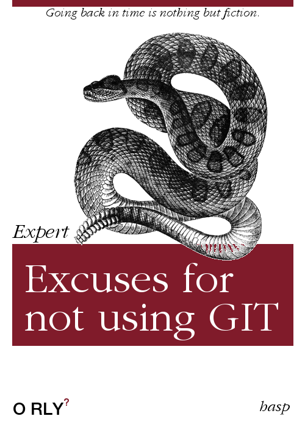
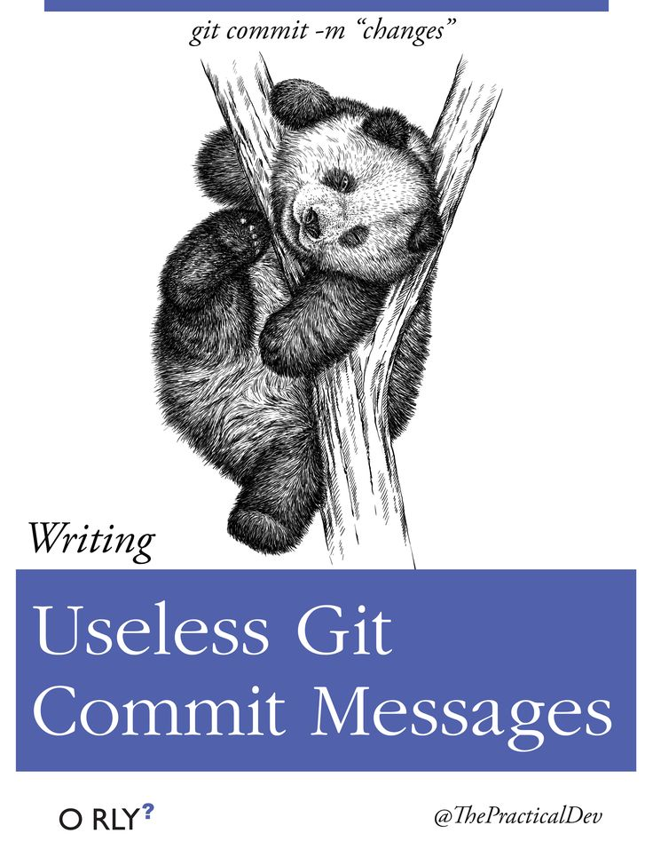

# Git Basics

To prevent any kind of confusion:

- GIT ... a **software tool**  - distributed version control system
- GITHUB ... a host for storing projects (repositories) which are 'version controlled' by git

---
<!-- .slide: class="left" -->
## Entry Point

Let's hop on the git-train by visiting a nice Introduction by Rainer Stropek:

[GitHub for Edu - Git](https://rstropek.github.io/GitHubEduWorkshop/#/4)

---
<!-- .slide: class="left" -->
## Additional Information

The following links are some of my favourites:

1. [How to teach Git](https://rachelcarmena.github.io/2018/12/12/how-to-teach-git.html) - we will have a look at that one!
1. and its successor: [Learn git concepts not commands](https://dev.to/unseenwizzard/learn-git-concepts-not-commands-4gjc).
1. [How to explain git in simple wors](https://smusamashah.github.io/blog/2017/10/14/explain-git-in-simple-words) - absolutely misleading title, this one goes into depth (hashes, blobs, commits,...)
1. [Understanding the GitHub flow](https://guides.github.com/introduction/flow/) - already mentioned by R. Stropek.
1. [Aha! Moments when learning Git](https://betterexplained.com/articles/aha-moments-when-learning-git/) - we will have a look at that one too!

---
<!-- .slide: class="left" -->
## Book recommendations

It is recommended **NOT** to read the following two books:

  
  

Instead use the online resources mentioned before!

---
<!-- .slide: class="left" -->
## Addon - Markdown

The default documentation on github is written with markdown.

I have to confess - I love it!

Once again, lets see waht R. Stropek tells us: [Github for Edu - Markdown](https://rstropek.github.io/GitHubEduWorkshop/#/5)