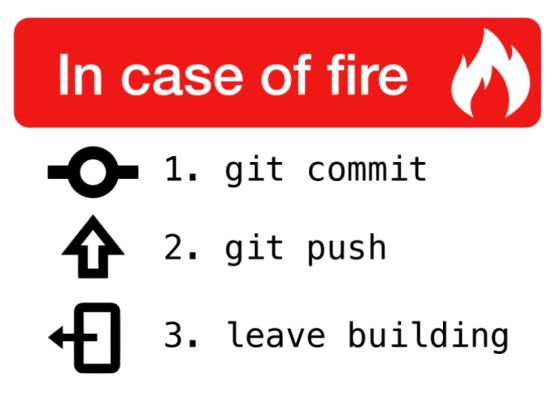

# GitHub Education

We will visit Rainer Stropeks slides: [GitHub for Edu](https://rstropek.github.io/GitHubEduWorkshop/#/7).

---
<!-- .slide: class="left" -->
## Filler

Well, the first slide gave all essential information, so here is just a small filler:

One might consider to replace 'leave building' by  'git out of building' ...
